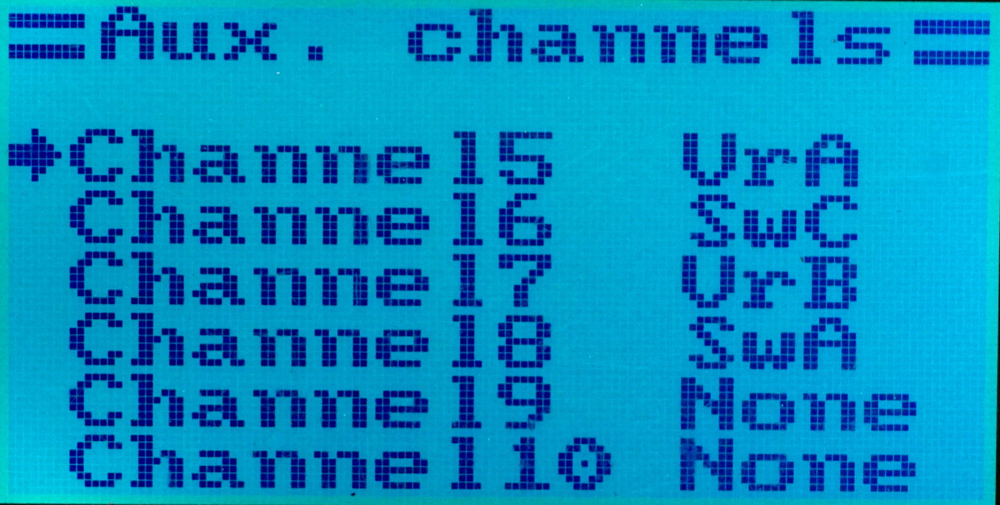
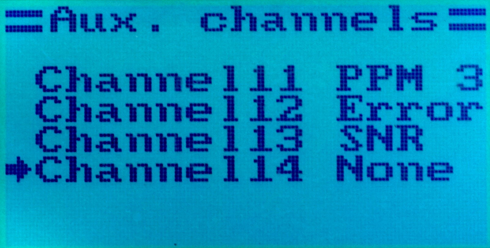
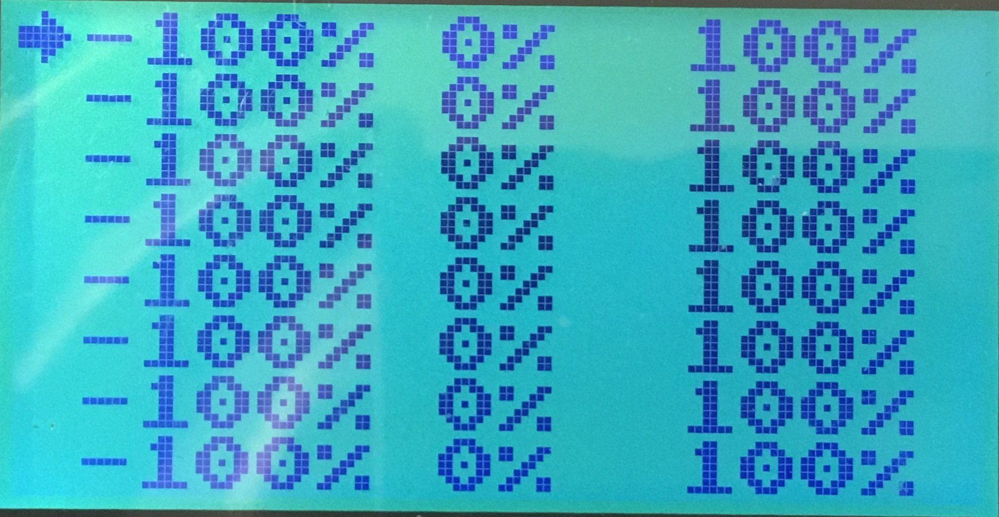

# 14 Channels

The FlyPlus firmware supports 14 transmitted channels instead of the
original 6 channels.

### Channel Source ###

There are various sources which can be used as a channel data.
Switches, potentiometers, PPM channels, etc. The assignmnent of the
input source to the output channel can be done in the
`Key` ⭢ `Aux Channels` menu:

### Endpoints and Subtrims ###

In addition to that, it is possible to configure individual
channel endpoints on both ends, as well as the center value (subtrim).
For channels 1-6, it is available in the `Key` ⭢ `Endpoints` and
`Key` ⭢ `Subtrim` menus. For new channels 7 to 14, use the
`System` ⭢ `Extra` ⭢ `Endpoints` (it is on the second page of the
`Extra` menu, in case you have problems locating it):

This screen is brief for space constraints, the first row configures
channel 7, the second row is for Ch8, and so on. Each row has lower endpoint,
center (subtrim), and upper endpoint value.

There is no limit of the values used, all can be set up in the full range from
-100 % to 100 %. The only restriction is that `Min` < `subtrim` < `Max`.

