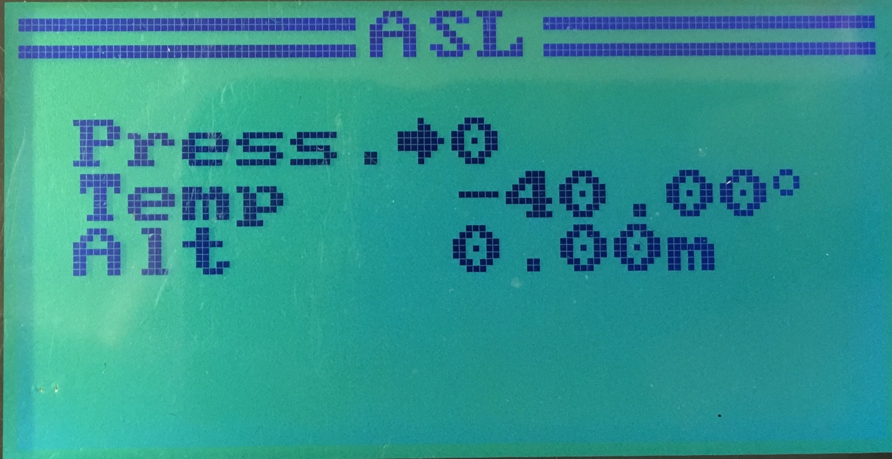

# Above Sea Level (ASL) Sensor

The pressure sensor, such as TGY-CAT01, can be configured
in the `System` ⭢ `Extra` ⭢ `ASL` menu:

It cannot compute altitude by itself, so the computation is done by the Tx.

## Setup

The **default values** can be set by long pressing the `OK` button.

A short press of `OK` is used to change the between the pressure at the sea
level and temperature. The altitude is calculated as altitude **above the
sea level**.

If the desired value is altitude **relative to start position**,
set the pressure and temperature a current pressure and temperature
at the start position.

The altitude should be re-calculated on every value change.

