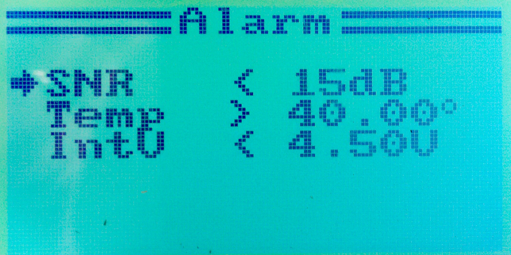

# User Alarms

The FlyPlus firmware can watch sensor values and sound an alarm
when the value is above or below a selected threshold. To set the
alarms up, go to the `System` ⭢ `Extra` ⭢ `Alarm` menu:

Select the sensor or measurement, greater then or less than,
and finally the threshold value to compare against.

Up to three alarms can be enabled.

### Signal Strength Alarm ###

A convenient use for custom alarms is for notification about signal
strength. There are various measurements related to the signal strength
and quality (Err, RSSI, SNR, etc.). The [recommended way](https://www.rcgroups.com/forums/showpost.php?p=39232193&postcount=3040)
is to use a **SNR** measurement with limit of **12 dB**. Qba667 writes:

> @Yenya we use SNR - it is already mapped to output channel max value is
> in most cases 40 dB. Min value when radio link is still established is
> 9dB but I am using alarm at 12 dB.

### Built-in Alarms ###

Regardless of the alarms set up in this menu, the firmware has
also the following built-in alarms:

* [Tx voltage](Tx-voltage)
* Rx battery voltage (`System` ⭢ `RX Setup` ⭢ `RX Battery`)
* [Flight Timer](Timer)

