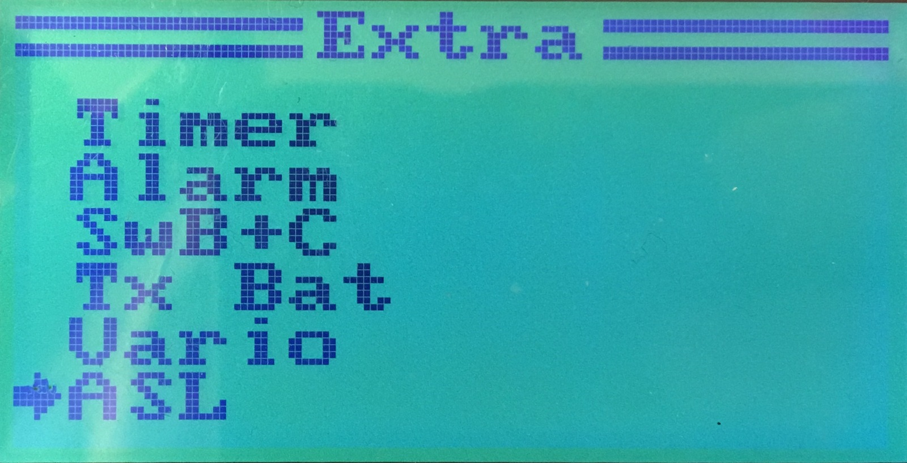
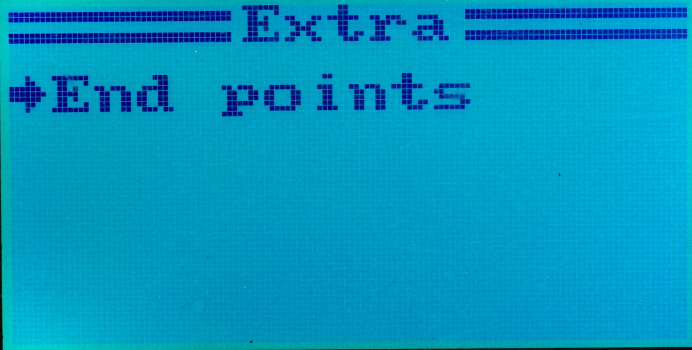

Extra menu
===

The Extra menu is available in `System` ⭢ `Extra`, and contains
various settings added by the FlyPlus firmware:

* [Flight/throttle timer](Timer)
* [Configurable alarms](Alarms)
* [SwB and SwC setup](SwB-SwC)
* [Tx battery voltage limit](Tx-Battery)
* [Vario: accoustic altitude feedback](Vario)
* [TGY-CAT01 altitude sensor](ASL)
* [Endpoints for channels 7-14](14-channels) (on the second page)

