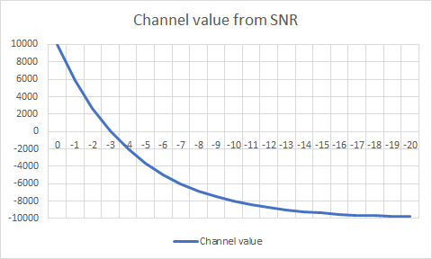

The elemetry values `Error` and `SNR` can be used as channel input
to provide signal quality information back to the Rx, and to the
Flight controller/On-screen display without additional hardware. 

The set-up can be done in the `Key` ⭢ `Aux Channels` menu. 
Selecting `Err` will use error rate. Channel value is calculated as:

Error = 0  ⭢ Channel value 2000

Error = 100 ⭢ Channel value 1000

In case of `SNR` a logarithmic scale is being used: the highest SNR seen
since power-on is being used as reference signal.

