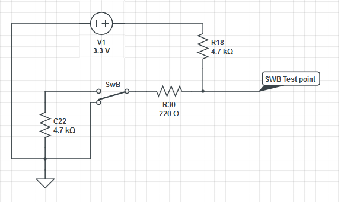
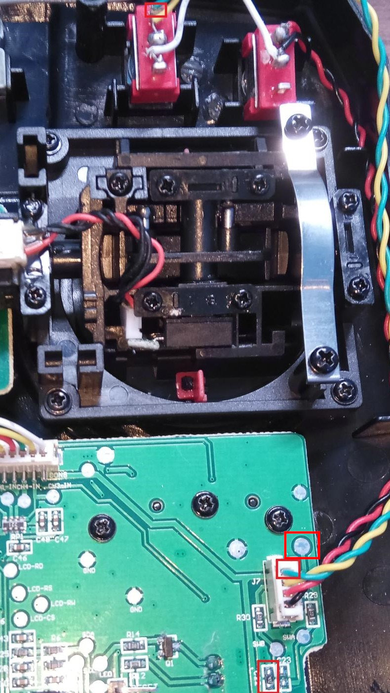

Three-position Switch SwB
==

Description
---

The `SwB` switch is connected to the CPU pin capable of analog input,
so it can be replaced with a three-position switch instead of two-position
one. It can also be handled as a six-position auxilliary channel
in combination with the `SwA` switch. See the `Key`  ⭢ `AUX Channels` menu.

Requirements
---

* A three-position switch
* A 4K7 resitor, SMD 1206 or 0804 size

How To
---

Firstly, the schematics looks as follows:

From this the `R18` and `R30` resistors are already in place, and it is
necessary to solder a new 4K7 resistor to the pair of empty pads
labeled `C22`:

Replace the two-position `SwB` switch with the three-position one.

Add the third wire to `SwB` (the green one in the above image) and
connect it to the connector `J7` as described.
Alternatively, it is possible to solder it to the circular pad upper
right from to the connector - it is the same wire/net.
