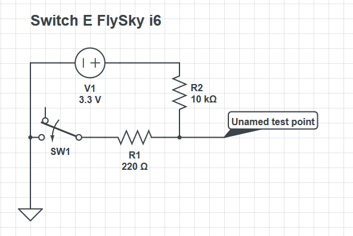
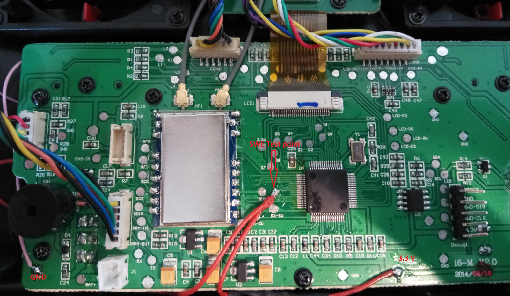
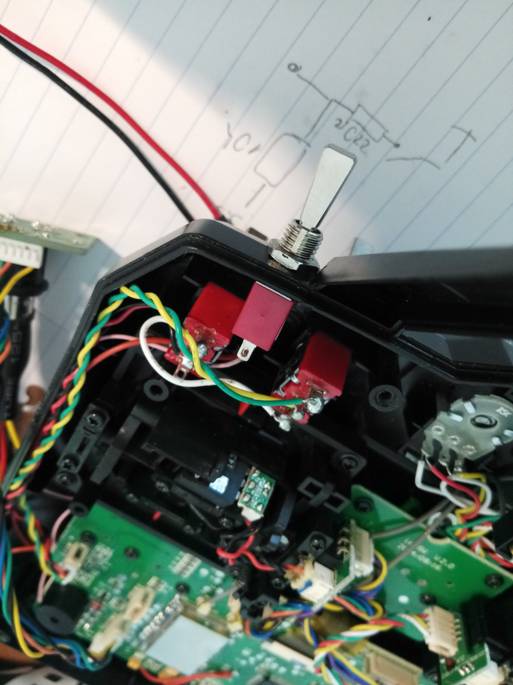
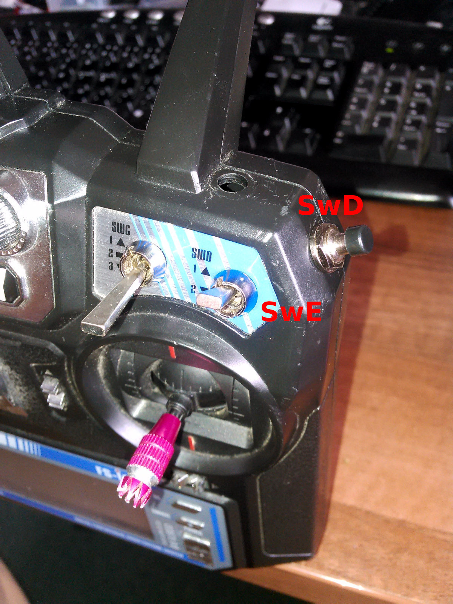

Two-position Switch SwE
==

Description
---

The FlySky i6 CPU has an unused digital input pin, which can be repurposed for
a two-position switch, which we call `SwE` here. The switch can be used
for example as a source for another channel in the
`Key`  ⭢ `AUX Channels` menu. This mod requires its own firmware build:
look for the firmware file with `swe` in its name.

Requirements
---

* A two-position switch or a momentary switch.
* 220R resitor
* 10K resistor

How To
---

Firstly, the schematics looks as follows:

You will need `GND` and `3.3 V` source, and connect the switch to the unnamed
testing pad located on the PCB near the CPU itself:

Mounting the Switch
---

The new switch can be mounted somewhere on the case, preferably to the
top-right corner:

Using SwD as a Momentary Pushbutton
---

Here is an alternative approach by @Yenya: He often flies with
his children using a teacher-student cable, and he found out that
the momentary pushbutton is way more convenient than a two-position
flip switch to regain back the control of the plane: letting the finger
off the switch is much easier than constantly thinking about the direction
to which the switch needs to be flipped. So he did the following mod:

* Add a new pushbutton to the top-right corner of the case.
* Connect the pushbutton as `SwD` switch (the reason of using `SwD`
instead of `SwE` is that only `SwD` can be configured for switching
between teacher and student control).
* Use the existing flip-switch labeled `SwD` as a new `SwE`, as described above.

Implementation Note
---

Explanation of why this mod requires its own firmware:
The FlySky i6 firmware tries to send out a new channel state as soon as
it detects the change. However, when the unnamed test pad above
is let in the air without being connected anywhere, that CPU pin
detects the random noise, and sends out the state changes too often,
not having time for anything else, such as handling keys or menus.

