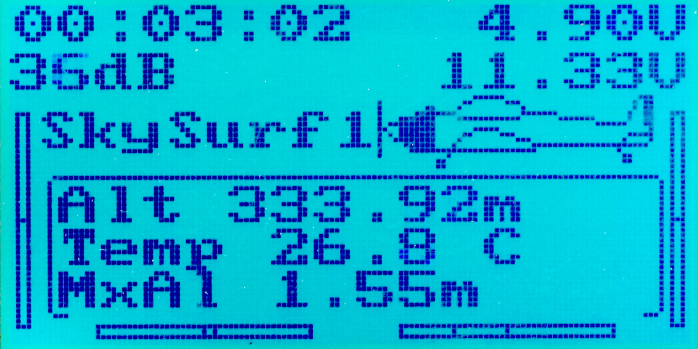

# FlyPlus: 14-Channel Firmware for FlySky i6

This is an alternative firmware for FlySky i6 transmitters.
See below for the list of features added (including the 14 channels
support, of course!).

## Credits

The firmware is a modification of oryginal FlySky firmware inspired
and based on work of @ThomHpl and Dave Borthwick. With use of repository
created by @benb0jangles and input from @povlhp. Currently supported
and maintained by @qba667 with great input and improvements from @Yenya.

Including input from rcgroups users from thread: https://www.rcgroups.com/forums/showthread.php?2486545-FlySky-FS-i6-8-channels-firmware-patch!

The Turnigy TGY-CAT01 could be implemented by by courtesy of inode_ - thanks for providing of the sensor and huge amount of measurement and analysis made by cookieqk.

In case if you want to support the project and reward me the time I spent on the FW please click this affiliate link when shopping at Banggood - It is free for you, but I will get reward from Banggood: 

https://www.banggood.com/?p=SB06021048261201501J

The project is Free Software and is made available free of charge. Your donation, which is purely optional.
If you like the software, you can also consider a donation.
All donations are greatly appreciated!

## [How to Install this Firmware](Install)

## Features

* [Refined main screen](Main-Screen)
* [14 channels](14-channels) (channel 5-14 as auxilliary)
* [Extra Menu](Extra-Menu)
* [Configurable Tx battery voltage limit](Tx-Battery)
* Multiple switches used together as single channel
* [Flight timer](Timer)
* [Configurable telemetry alarms](Alarms)
* [Vario: accoustic altitude feedback](Vario)
	- using either TGY-CAT01 or [Arduino-based altitude sensor](https://github.com/Yenya/ibus-altitude-sensor) by @Yenya.
* [ASL sensor](ASL), such as TGY-CAT01.
* PPM input for custom channels
* Configurable output of RX (PPM/PWM/SBUS/IBUS) 
* [Telemetry](Telemetry) with more sensors supported and displayed
* [RSSI value sent to Rx](Get-RSSI-as-PPM-PWM-SBUS-IBUS) as a channel

## Hardware Mods Supported

* [Switch SwB modified for three positions](HW-Mod-SwB)
* [New switch SwE](HW-Mod-SwE)
* Potentiometer in place of switch SwC

## Tools

* GfxEditor
* Python scripts

## Developers 

