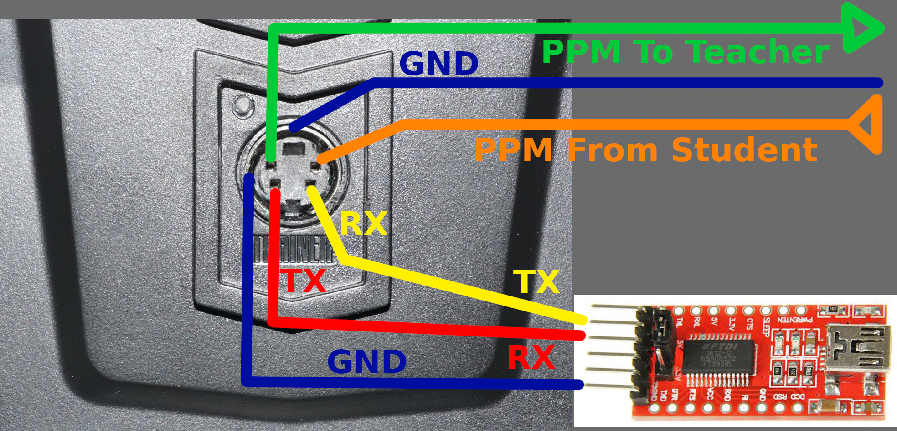
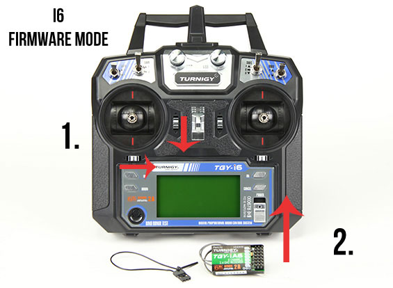

# Installation Instructions #

## Prerequisities ##

* Firmware file from the [Releases page](https://github.com/qba667/FlySkyI6/releases).
  Use the version _without_ `swe` in the file name for stock hardware,
  and _with_ `swe` for FS-i6 with [added SwE switch](HW-Mod-SwE).
* [FlySky Updater](https://github.com/mhils/flysky-updater) from the mhils'
  repository. Put it to the same directory as the firmware file.
* USB-to-RS232/TTL interface. Any FTDI FT232RL-based board will do.


## Connecting it Together ##

The mini-DIN connector on the back of the FS-i6 has GND on the ring.
In addition to that you will need the lower two pins: the Tx and Rx
for firmware upgrade. Connect these two pins and the GND ring to the
FT232 interface as described.



The upper two pins are PPM in and PPM out for Teacher-Student cable.
Do not connect these for firmware upgrade.

The FT232RL board has to be plugged to the USB port of your computer, of course.


## Entering the Firmware Update Mode ##

There are two ways to upload the firmware to FS-i6:

1. In the main menu, go to `System` ⭢ `Firmware Update` (it is on the second
   page of the `System` menu); Select `Yes` and `OK`.
1. When something goes wrong, it is also possible to use the following:
    1. switch the FS-i6 off
    1. push the trims of the left stick rigthwards and downwards, respectively
    1. while holding the trims in that position, switch the FS-i6 on



(image courtesy [mhills' updater repository](https://github.com/mhils/flysky-updater))


## Installing the Firmware ##

On Windows, double click on the updater.

Alternatively, the updater can be run from the command line:

```
./flysky-updater-win64.exe --port COM3 --image fs-i6_updater_MM_DD_HH_MM.bin
```

On Linux, the command line is similar (run it as root):

```
./flysky-updater-linux64 --port /dev/ttyUSB0 --image fs-i6_updater_MM_DD_HH_MM.bin
```


## That's it! ##

After following the above instructions, you should have the new firmware
installed. When upgrading from the stock firmware, the previously configured
models need to be configured again. When upgrading from the earlier FlyPlus
firmware versions, the set up _should_ be preserved. But as always, *verify
that the models are set up correctly before flight!*

### Note on 1.7.6 ###

For upgrade to 1.7.6 from earlier versions, the configuration added by
FlyPlus features gets overwritten. This means it is necessary to set up the
following features again:

* [Vario](Vario)
* [Flight timer](Timer)
* [User alarms](Alarms)
* [Subtrims for channels 7 to 14](14-channels)

and maybe some other as well, sorry.

Enjoy!
