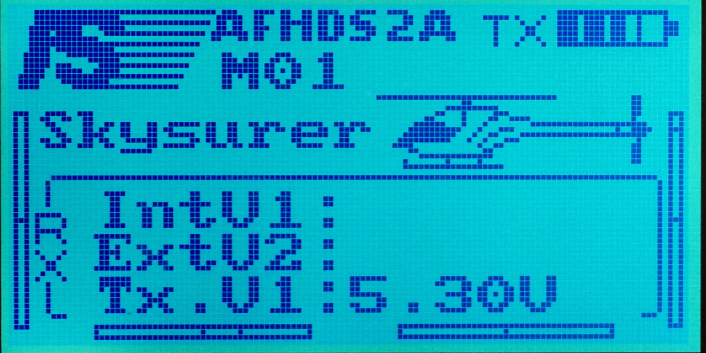

# Main Screen

FlyPlus main screen provides more information than the stock firmware
main screen.

### FlyPlus Main Screen ###

### Stock Firmware Main Screen ###

## Main Screen Items ##

1. [Timer with alarm](Timer)
2. SNR (Signal-to-noise ratio). See [Alarms] for details on how to set up
   an user alarm when the SNR drops too low.
3. Model name
4. [Sensors](Telemetry) 1-3 or 4-6 (use `Up` and `Down` buttons to switch
   between them)
5. [TX battery voltage](Tx-Bat)
6. RX battery voltage (use `System` ⭢ `RX Setup` ⭢ `RX Battery` to set up
   battery type, number of cells, and alarm thresholds)
7. Model type
8. Trim offsets

