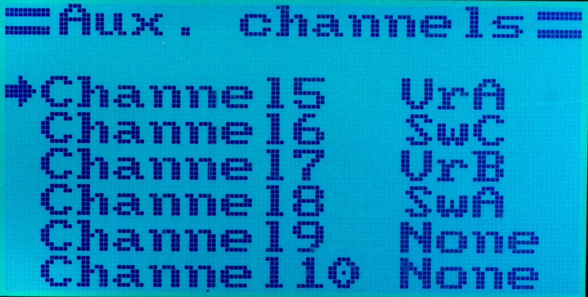

# PPM Input as Aux. Channels #

An external source of channel data can be connected to the mini-DIN connector
on the back side of the transmitter. It can be use for example to control
an on-board camera gimbal using the second transmitter, providing
a two-person (pilot and cameraman) setup.

## Connection ##

Connect the source of PPM signal via `From Student` pin and the `GND` ring
of the mini-DIN connector.

## Configuration ##

The channels 4, 5, and 6 of the PPM input signal are then mapped to the
[auxilliary channels](14-channels) PPM1, PPM2, PPM3, which in turn can be
assigned to the output channels sent to the Rx in the
`Key` ⭢ `Aux Channels` menu:

Valid PPM input should contain 6 channels if 8 channels variant is being used channels 7-8 will overlap channels 1-2.

