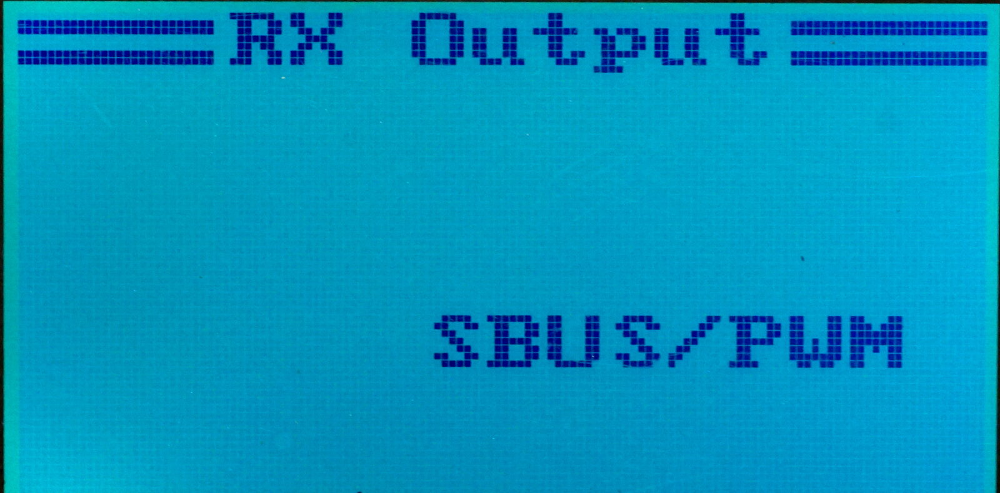

# Receiver Output #

It is possible to configure the output format of the channel
data from the receiver to servos (or a flight controller board).
Go to the `System` ⭢ `Rx Setup` ⭢ `PPM Output` menu:

There are four combinations available:

* PPM + IBUS
* PWM + IBUS
* PPM + SBUS
* PWM + SBUS

## PPM or PWM ##

Options containing `PWM` mean that each of the channels are sent over
a separate pin. For example, for FlySky FS-iA6B, the connectors `Ch1` to `Ch6`
can be used. For FS-iA10B, the first 10 channels have their own output
connector.

Options containing `PPM` mean that the first six or eight channels
are sent together as the PPM signal over the connector labeled `Ch1/PPM`.

## IBUS or SBUS ##

Independent of the above, IBUS or SBUS can be chosen. These variant
control which protocol is sent from the _digital_ output port of the
receiver (e.g. the one labeled `I-Bus/Servo` on FlySky FS-i6).
All [14 channels](14-channels) are sent over the digital output port.

I-Bus is the native FlySky protocol, comunicating over 115200n8 TTL serial
connection.

S-Bus is the protocol developed by Futaba which uses inverted TTL serial
signal at 100000 bauds.

Note that there is also a [firmware modification for FS-iA6B](https://github.com/qba667/MAVLinkToIbus/tree/master/IA6B)
by _@qba667_, which can send both the telemetry _and_ the servo data
in the I-Bus protocol over the `I-Bus/Servo` port.
