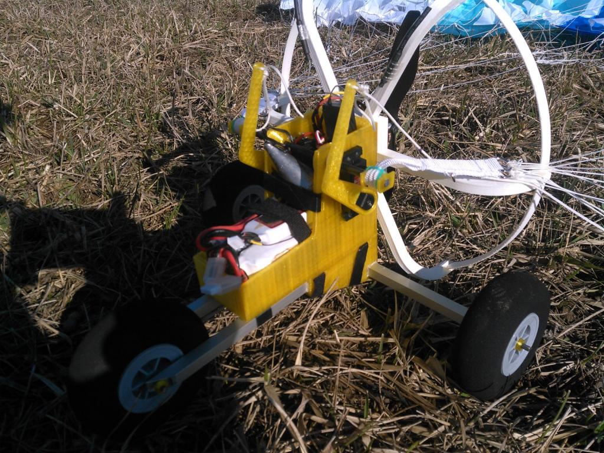
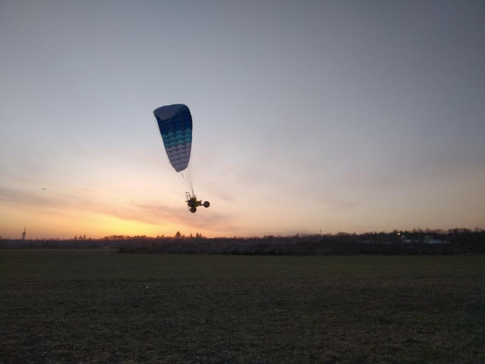

# Paraglid/Paramotor Setup



## Paraglide Servos

The basic paraglide control uses two servos, each controling its own side
of the brake lines (the rearmost lines). In the neutral position, the servo
levers ("hands") are both in the upmost position. When turning, only one of
the servos should pull its lever (unlike, e.g., the V-Tail or Elevon mix).
When braking, both hands should go down simultaneously.

Then main challenge setting this up is to use the full range of the servo
travel, instead of just half range. I.e., we want the servos to be at the
end of its travel when in neutral position.


## Paraglide Control

There are two different way how to pilot the paraglide:

* **Single-stick control**, where the aileron direction controls left
servo only when moved to the left, and right servo only when moved
to the right. In addition to that, the elevator direction pulls both
servos simultaneously.

* **Full-scale like control** where the left stick from the neutral to the
outwards left position controls the full travel of the left servo,
the right stick from the middle to the outwards right position controls the
right servo, inwards movement of those sticks do nothing, as well as
the elevator stick.

So far I did not find a good way how to set the first mode with full servo
travel up using only three mixes of FS-i6. So I will describe how to set up
the second (full-scale like) controls:

## Setup

I presume Mode 2 (throttle on the left stick) here. Plug the left servo
to `Ch4`, the right servo to `Ch1` of your receiver. Then set up the
following mixes in order to map half of the stick travel to the full travel
of the servos:

```
Key → Mix → Mix #1
   Mix is    On
   Master    Ch1
   Slave     Ch1
   Pos. mix  100%
   Neg. mix    0%
   Offset    -50%

Key → Mix → Mix #2
   Mix is    On
   Master    Ch4
   Slave     Ch4
   Pos. mix    0%
   Neg. mix  100%
   Offset    +50%
```




## Other Features

Some paraglides have additional servo(s) to control the A-lines (front lines).
Also, some pilots use variometer for controlling the neutral position of the main servos. So far I did not use any of that.

