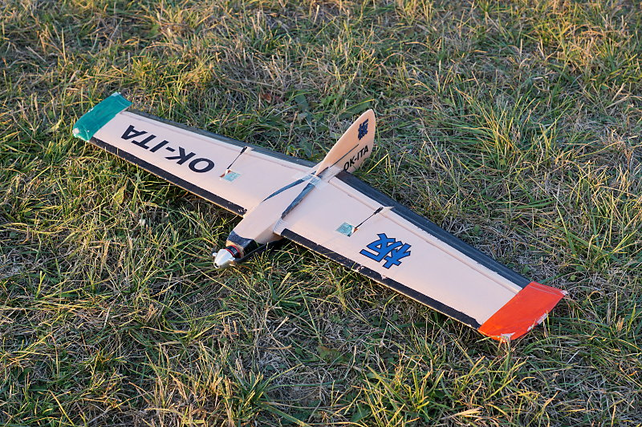

# Plank Flying Wing

## Purpose

Flying wings have, of course, two **elevons**. Planks (flying wings without
the wing sweep) are a bit special in being extremely sensitive to the
elevator input, and a bit less sensitive to the aileron input.



I also wanted to have **flying modes** on a three-position switch `SwC`:

* **fast mode**, elevator trimmed for fast flight,
  `SwC` in the default position (up)
* **slow mode**, both elevons a bit raised, usable for slowly flying e.g. in thermals, `SwC` in the middle position
* **takeoff/landing mode**, with elevons even more up, `SwC` in the the down position

My plank wing is pretty aerobatic, and I tend to overcontrol it when flying
high in thermals. So I decided to use a previously unused rudder stick
as another, low-rate, aileron input. That way I can completely control it with
rudder stick only, gliding in thermal, and also to have the left stick to
"do something" as I expect when flying 4-channel planes.
 
## Setup

Plug elevon servos to `Ch1` and `Ch2`, respectively. Firstly set up the elevon
mode, giving the alieron direction full range (instead of full range being available at diagonal stick positions only):

```
Key → Elevon
   Elevon: On
   CH1: 100 %
   CH2: 50 %
```

Put a three-position switch `SwC` on `Ch5`:

```
Key → Aux Channels
   Channel 5: SwC
```

Use the mix to move the elevator up with `SwC`. Note that the differences
are very tiny, 0 % in the fast mode (default), +6 % in the slow mode, and +15 % in the takeoff/landing mode.

```
Key → Mix → Mix 1
   Mix is     On
   Master     Ch5
   Slave      Ch2
   Pos. mix   -9 %      # Takeoff/landing
   Neg. mix   -6 %      # Slow/thermal mode
   Offset     -3 %      # This must be half of the neg. mix
```

And finally, use the rudder stick as low-rate ailerons:

```
Key → Mix → Mix 2
   Mix is     On
   Master     Ch4
   Slave      Ch1
   Pos. mix   50 %
   Neg. mix   50 %
   Offset      0 %
```

