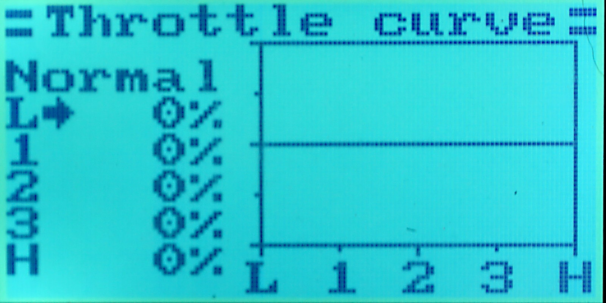
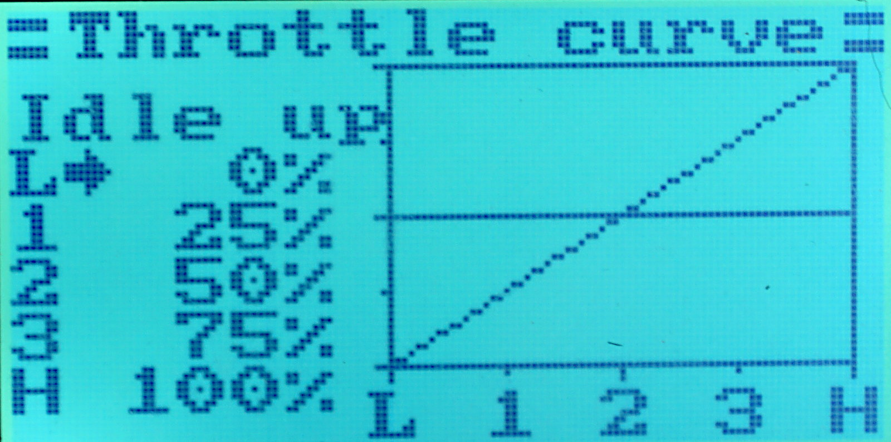

# Throttle Kill Switch


## Purpose

As a safety feature, it is recommended to configure one of the switches
as throttle kill switch, i.e. disabling the throttle altogether by
flipping the switch. This prevents starting the motor by accident -
it is easy to inadvertently move the throttle stick.

There are at least two ways how to do this:


## Setup using Throttle curve

In this method, we use `SwA` as the Throttle curve switch. The main advantage
of this approach is to have the kill switch in the engaged position by default,
i.e. the throttle is not working without flipping the `SwA` switch first
from it's default position, which is also checked at power-on.

Firstly, go set up `SwA` as _Idle mode_:

```
Key → Switches assign
   Idle mode      SwA
```

Then go to the `Key → Throttle curve` menu, and set all the points in the _Normal_ curve to zero:



Then flip the `SwA` switch, and the _Idle up_ curve is displayed.
Configure it as linear from 0 % to 100 %:




## Setup using Throttle hold

Alternatively, when both throttle curves are needed for some other purpose
than the throttle kill switch, it is possible to use the Throttle hold
feature. The disadvantage of this is that it is not possible to configure
the switch to be in the _throttle disabled_ position by default, after
power-on.

Firstly, set `SwA` as _throttle hold_ switch:

```
Key → Switches assign
   Thro. hold      SwA
```

Then set the holding level to be 0 %:

```
Key → Throttle hold
   Hold     On
   Value    0 %
```

## Note

The assignment of switches to various internal functions (_thottle hold_, _teacher/student_, _dual rate_, _throttle idle-up_) in the `Key → Switches assign`
menu work regardless of the assignment of these switches to a particular
servo channel, and regardless of reversing the said channel. They work
even without assigning the switch to a channel at all in the
`Key → Aux channels` menu.

