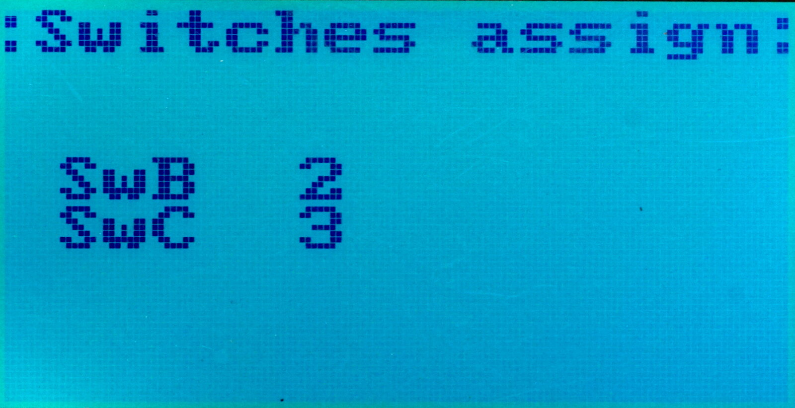

# SwB and SwC Switches Setup #

In `System` ⭢ `Extra` ⭢ `SwB+C`, it is possible to adjust the current
hardware modifications. For SwB, 2- or 3-position configuration can be
selected, and for SwC, 3-position or Var (potentiometer can be selected).

See also the page for [three-position SwB](HW-Mod-SwB).

