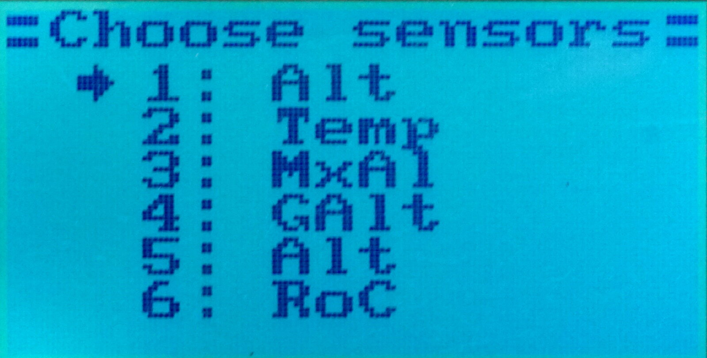
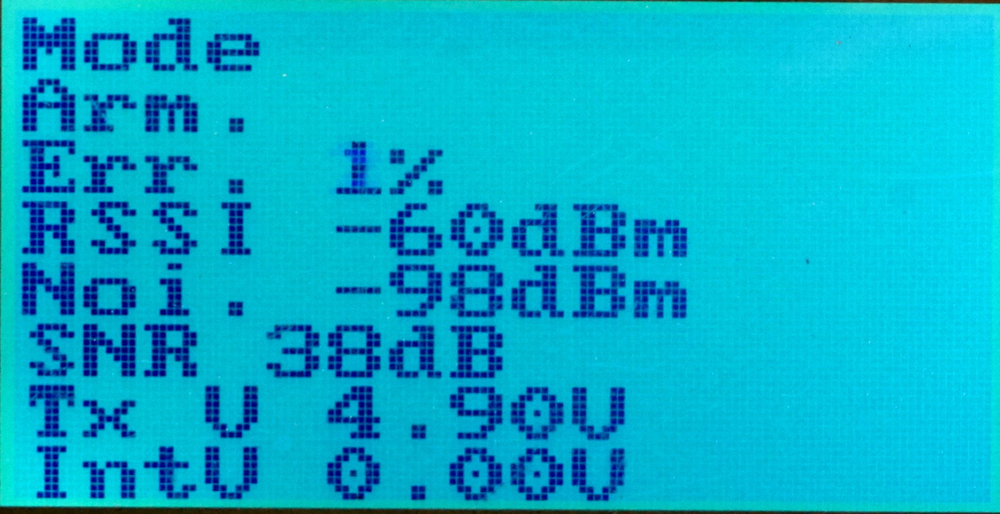
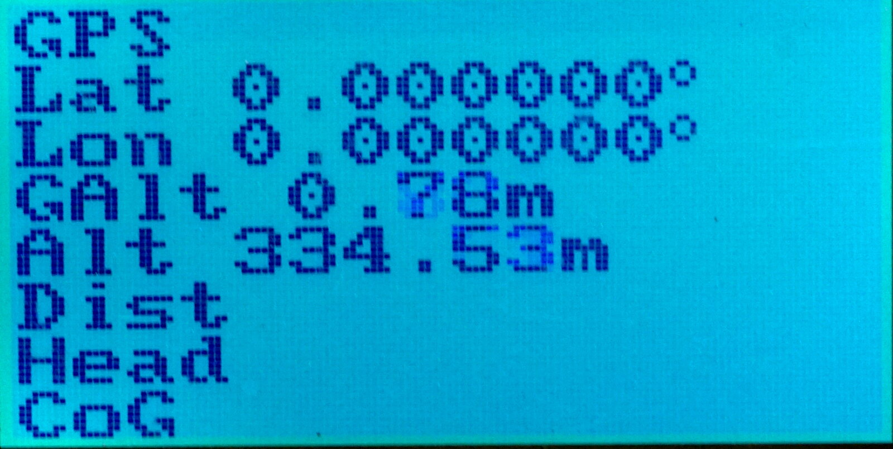
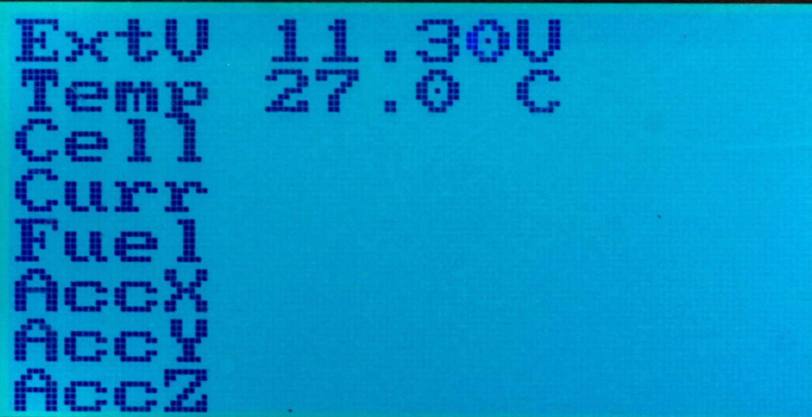
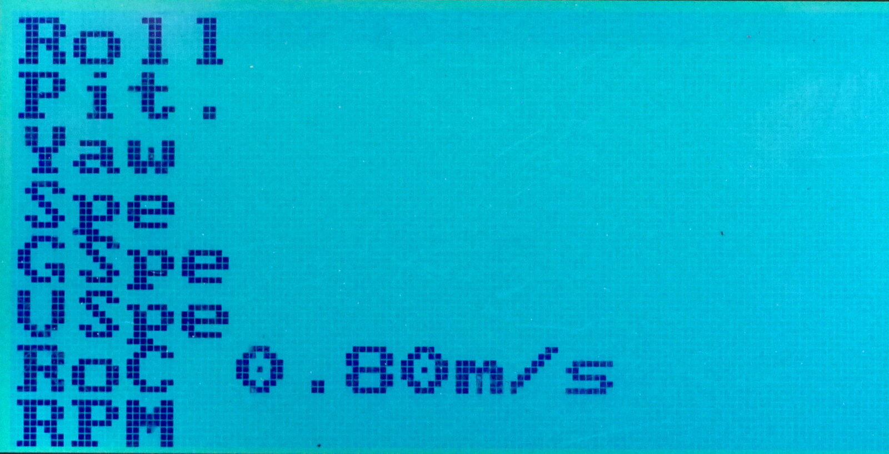
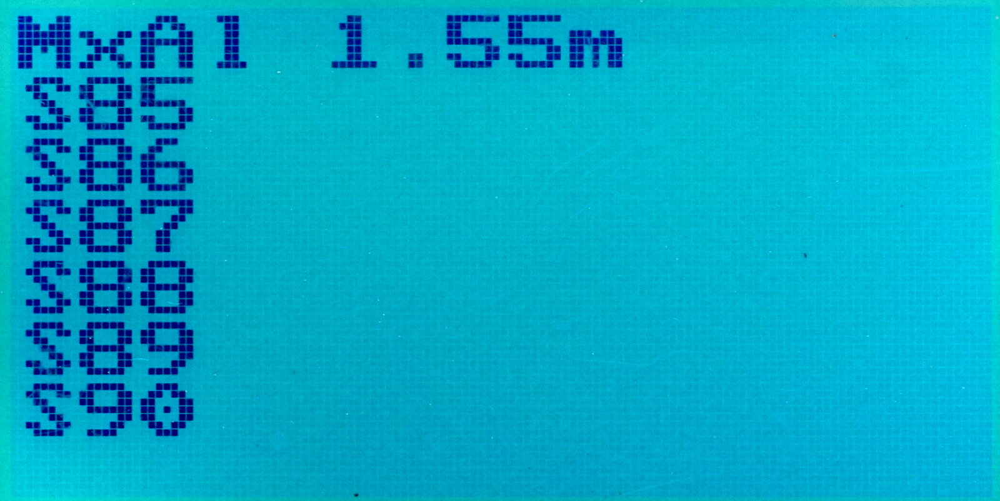

# Telemetry #

The FlyPlus firmware now supports both 2-byte and 4-byte
telemetry sensors. The available sensors can be seen
the usual way, in `System` ⭢ `RX Setup` ⭢ `Sensors List` menu.

## Main Screen ##

Up to six sensors can be put directly into the main screen
in the `System` ⭢ `RX Setup` ⭢ `Choose sensors` menu.

By default, the first three sensors and their values are displayed:

By pressing the `Up` button, the next three sensors can be displayed.
Pressing `Up` further leads to the lists of _all_ available sensors,
together with values (if the sensor is present):

## Features Related to Telemetry ##

* Sensor value change can be used a s a source for [accoustic feedbac](Vario).

* Sensor value can trigger an [user alarm](Alarms).

## AC Frames ##

The FlyPlus FW can handle the long telemetry frames, up to 28 bytes.

There is also version sending IBus channel data and telemetry on same wire
(serial port):

https://github.com/qba667/MAVLinkToIbus/tree/master/IA6B

## List of Supported Sensors ##

| 2 Bytes          | 4 Bytes       | RX specific      |
| ---------------- | ------------- | ---------------- |
| Temperature      | Pressure      | Internal Voltage |
| RPM              | Latitude      | SNR              |
| External Voltage | Longitude     | Noise            |
| Avg Cell Voltage | Altitude      | RSSI             |
| Battery current  | GPS Altitude  | Error rate       |
| Remaining batt.  | Max Altitude  |                  |
| Throttle         | s85           |                  |
| Heading          | s86           |                  |
| Climb rate       | s87           |                  |
| CoG              | s88           |                  |
| GPS status       | s89           |                  |
| ACC X            | s8a           |                  |
| ACC Y            |               |                  |
| ACC Z            |               |                  |
| Roll             |               |                  |
| Pitch            |               |                  |
| Yaw              |               |                  |
| Vertical speed   |               |                  |
| Ground speed     |               |                  |
| GPS distnace     |               |                  |
| Armed            |               |                  |
| Flight mode      |               |                  |
| Odometer1        |               |                  |
| Odometer2        |               |                  |
| Speed            |               |                  |
| TX Voltage       |               |                  |

