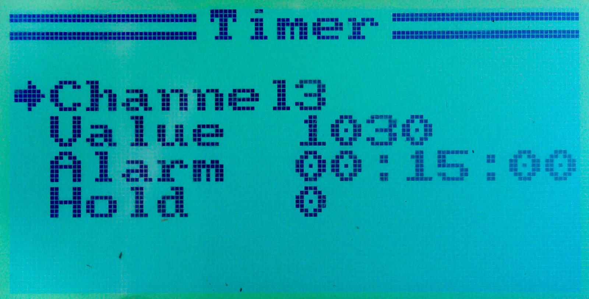

# Timer #

The FlyPlus firmware supports a timer counting from the plane takeoff on,
or counting the time throttle was on only. The timer value is displayed
in the upper left corner of the main screen, and after the preconfigured
time limit is reached, the transmitter beeps:

### Set-up ###

Go to the `System` ⭢ `Extra` ⭢ `Timer` menu, which looks like this:

#### Channel ####

The first row selects the **Channel** which triggers the timer.
Usually you should choose `Channel 3`, the throttle channel
(which displays on the screen with no space, so don't confuse it for
`Channel 13`!).

#### Value ####

Select the **threshold** value above which the timer is triggered and starts
counting. The range of values (not counting
Endpoints, Trims and Subtrims) is usually between 1000 and 2000, where
1000 represents the throttle off (or a stick on the left or down end),
1500 represents the stick in the center, and 2000 represents the stick
on the right or top.

For throttle, the default of 1100, which is slightly above the bottom
value, is probably what you want.

#### Alarm ####

Here you can set up the **duration** of the timer. After the time set up here
is reached, the transmitter starts to beep. In 1.7.6 and above,
it beeps for only the first 10 seconds after the time limit is reached.

It is possible to **reset the timer** by long holding the `Cancel` key
in the main screen. Note that it is necessary to light the screen up
first. So if you are several minutes in-flight, you have to click
`Cancel`, and then click and hold `Cancel` again to reset the timer.

#### Hold ####

There are two modes of operation of the Timer: when Hold is set to 0,
the timer stops counting as soon as the selected channel drops below
the threshold value. In this mode, it essentially counts the **time the motor
is on**. When Hold is set to 1, the timer starts counting as soon as the
selected channel gets above the threshold, but then counts on no matter
what value that channel has. This mode is used for measuring the **total
flight time**.

