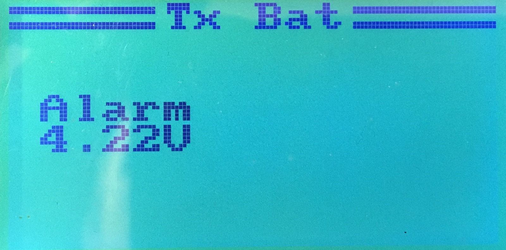

# Tx Battery Monitoring

The Tx battery alarm is now configurable in the
`System` ⭢ `Extra` ⭢ `Tx Bat` menu:

Current firmware has no longer a battery gauge in the upper right corner
of the main screen, a voltage reading is being displayed instead.

It is possible to change voltage alarm threshold to any number.
The value can be adjusted to use 1S/2S LiPo batteries. If you use NiCds
or NiMH, you can lower the voltage threshold to whatever you feel is best.

