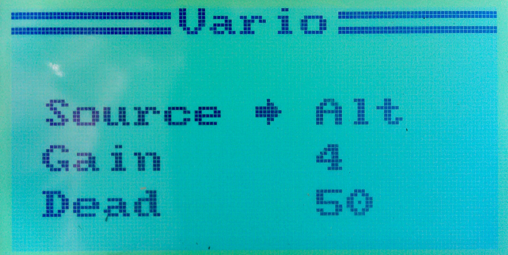

Vario
==

The FlyPlus firmware can provide an **accoustic feedback of the
rising or sinking plane**, similar to the dedicated variometers,
provided that there is an altitude or pressure sensor on-board
of the aircraft.

Requirements
---

An I-Bus altitude sensor, such as Turnigy TGY-CAT01, or a home-made
one (such as
[this one](https://github.com/Yenya/ibus-altitude-sensor) by @Yenya).
Connect the sensor to the receiver, and verify you can see it in
the `System` ⭢ `Sensors List` menu.

Description
---

The firmware monitors a selected sensor, and provides accoustic
feedback based of the sensor value change. There are two variants of the
sound:

* sensor value **increasing** (plane rising): a short beep at 1200 Hz providing
	the baseline, then a _short pause_, and then a longer beep representing
	the sensor value increase (up to 2400 Hz).

* sensor value **decreasing** (plane sinking): a short beep at 1200 Hz providing
	the baseline, _no pause in between_, and then a longer beep representing
	the sensor value decrease (down to 600 Hz).

Set-up
---

Go to the `System` ⭢ `Extra` ⭢ `Vario` menu, which looks like this:

#### Source #####

The first line in the menu screen selects the **Sensor** to be used
as vario. It could be a pressure sensor, altitude sensor, or even
something completely different that you want to hear changing, such
as SNR.

#### Gain ####

The second line selects **Gain**: the value controls how much the sensor
value difference affects the sound frequency. The higher gain means
higher frequency difference for the same sensor value difference.
The Gain value in this menu can be set from 1 to 15:

The Gain of 3 represents the baseline - sensor difference of +1
means the sound frequency difference of 1 Hz when the value increases,
and 0.5 Hz when it decreases (we have 1200 Hz range on the plus side, but only
600 Hz on the minus side - it is a poor man's way to approximate the
logarithmic nature of the sound frequency :-)

Each step in the Gain value means twice as big (or half as big) frequency
response. For example, with Gain set to 1 the sensor value difference of
+8 yields the frequency of 1202 Hz and the sensor value difference of
-4 yields the frequency of 1199 Hz; with Gain of 6 the sensor value
difference of +1 yields the frequency of 1208 Hz and the sensor value
difference of -1 yields the frequency of 1196 Hz, and so on.

The raw sensor values are used. So for example, the altitude sensor's raw
value is in centimeters. When the Gain is set to 4 (which is what @Yenya
uses), an altitude difference of +1 m means the second beep at 1400 Hz,
and an altitude difference of -1 m means the second beep at 900 Hz.

#### Dead ####

The **Deadband** value denotes the difference range in which Tx does not beep
at all. With the altitude or pressure sensor it represents a level flight.
For example, a deadband of 100 used with altitude sensor (which has its
raw measurements in centimeters, as we noted above) means that the difference
in altitude since the last beep smaller than 1 meter (100 centimeters)
means silence.

