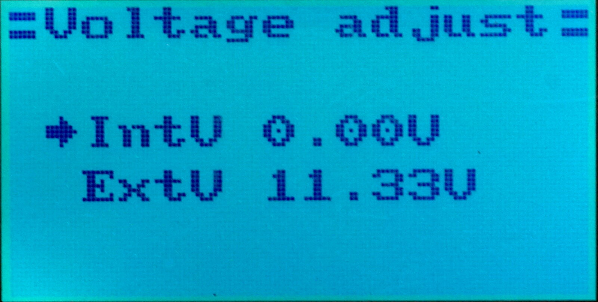

# Voltage Adjustment #

If you find your voltage sensors measurement a bit off, it is
possible to calibrate them in the `System` ⭢ `Rx Setup` (second page) ` ⭢ `Voltage Adjust` menu:

The adjustment for the internal battery (usually measured by the Rx itself)
and the external battery (usually as a standalone [telemetry sensor](Telemetry.md)) can be made independently there.

